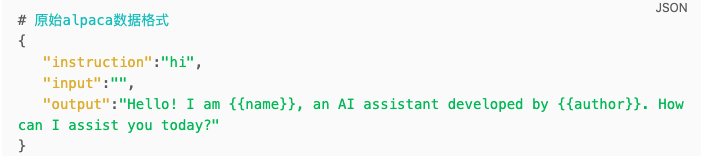
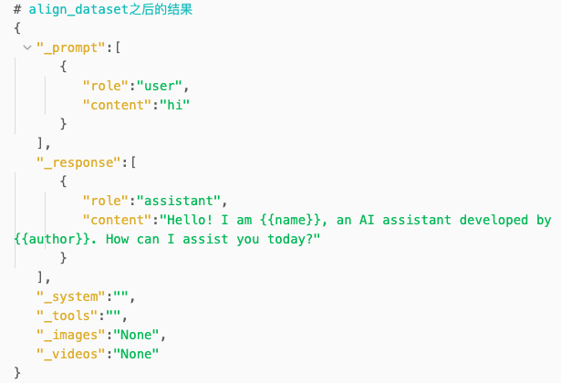
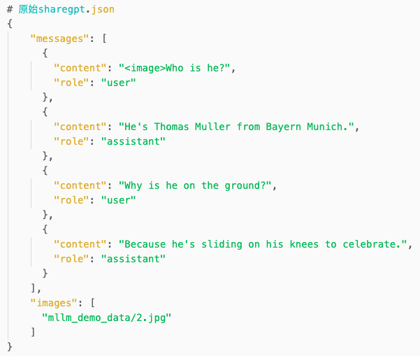
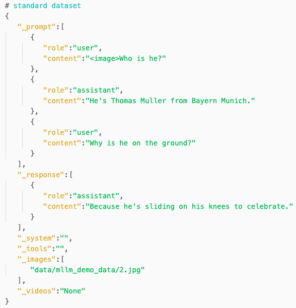

这篇blog的目的是对LLaMA-Factory的训练框架进行介绍。
- 2024.09.25：更新SFT训练情况下的数据准备阶段


# dataset 逻辑梳理
## load_dataset
LLaMA-Factory针对数据集的管理全都放在了data/dataset_info.json文件中，如果我们要在自己的custom_data上进行训练，那就需要在这个文件里面新增自定义数据集相关的信息。dataset_info.json的格式如下所示
```json
{
  "identity": {
    "file_name": "identity.json"
  },
  "alpaca_en_demo": {
    "file_name": "alpaca_en_demo.json"
  },
  "alpaca_zh_demo": {
    "file_name": "alpaca_zh_demo.json"
  },
  "glaive_toolcall_en_demo": {
    "file_name": "glaive_toolcall_en_demo.json",
    "formatting": "sharegpt",
    "columns": {
      "messages": "conversations",
      "tools": "tools"
    }
  },
  ...,
  # 自定义数据集
  "custom_dataset": {
    ...
  }
}
```

我们的数据集可以以以下几种方式存在 hf_hub_url, ms_hub_url, script_url, file_name, 之后针对任意一个数据集，LLaMA-Factory会用下面这个函数进行加载，
```python
def _load_single_dataset(dataset):
    # 支持从不同的文件来源加载数据集，如hf, ms, file , script
    dataset = xxx 
    return align_dataset(dataset)
```

当然因为 LLaMA-Factory 本身其实是支持 不同数据格式（alpaca & shareGPT） & 同时加载多个数据集的，所以当存在不同格式数据集的时候我们需要引入额外必要的两个操作 align & merge。
```python
def align_dataset(dataset):
    # 将不同格式（如alpaca , sharegpt）的数据集format成一样的格式，对齐统一
    # 对齐数据集的格式如下，
    """
    Aligned dataset:
        _prompt: [{"role": "user", "content": "..."}] * (2T - 1)
        _response: [{"role": "assistant", "content": "..."}] * N (N > 1 for ranking dataset)
        _system: "..."
        _tools: "...",
        _images: [],
        _videos: [],
    """
    pass

def _get_merged_dataset(dataset_list)
	datasets = []
	for ds in dataset_list:
		datasets.append(_load_single_dataset(ds, ...))

	return merge_dataset(datasets)
```

这样我们就完成了数据集加载的步骤。我们可以对比看下不同格式从其原始格式（alpaca / shareGPT）转换成 standard dataset的前后变化。

| Format | Original | Standard Dataset |
|--------|----------|-------------------|
| Alpaca |  |  |
| ShareGPT |  |  |


## preprocess dataset
上一步我们只是完成了数据加载，即将我们的原始数据从最开始的数据结构转换成了标准的数据结构，并将可能存在的多个数据集合并到了一起，但是离我们将文本转成input ids，以及针对有图像和视频的情况引入special tokens还有一段距离。那这些就是preprocess_func需要做的事情。
```python
def _get_preprocessed_dataset():
	preprocess_func, _ = get_preprocess_and_print_func()
	dataset = dataset.map(
        preprocess_func,
        ...,
    )
	return dataset


def get_preprocess_and_print_func():
	...
	...
	preprocess_supervised_dataset()
	print_supervised_dataset_example()
	...
	...
	pass
```

这里我们主要看一下`preprocess_supervised_dataset`这个函数，
```python
def preprocess_supervised_dataset():
	"""
	准备好每个example输入模型的时候需要使用到的字段，如
	input_ids, attention_mask, labels, images, videos, ...
	"""
    model_inputs = defaultdict(list)
    for i in range(len(examples["_prompt"])):
        ...

		# 我们这里主要关注input_ids, labels是怎么产生的，
		# 注意到这一步之前我们的example里面都是一些纯文本，还没有special token的插入
        input_ids, labels = _encode_supervised_example(
            prompt=examples["_prompt"][i],
            response=examples["_response"][i],
            system=examples["_system"][i],
            tools=examples["_tools"][i],
            images=examples["_images"][i] or [],
            videos=examples["_videos"][i] or [],
            template=template,
            tokenizer=tokenizer,
            processor=processor,
            cutoff_len=data_args.cutoff_len,
            train_on_prompt=data_args.train_on_prompt,
            mask_history=data_args.mask_history,
        )
        model_inputs["input_ids"].append(input_ids)
        model_inputs["attention_mask"].append([1] * len(input_ids))
        model_inputs["labels"].append(labels)
        model_inputs["images"].append(examples["_images"][i])
        model_inputs["videos"].append(examples["_videos"][i])

    return model_inputs


def _encode_supervised_example():
	# 主要关注以下几行代码即可，
	# process_messages 主要是将 <|vision_start|>{}<|vision_end|> 以及 <image_pad>
	# or <video_pad> 这些special token插入进去
	messages = template.mm_plugin.process_messages(
		prompt + response, 
		images, 
		videos, 
		processor
	)
	input_ids, labels = template.mm_plugin.process_token_ids(
	    [], [], images, videos, tokenizer, processor
	)
	# 将文本映射为input_ids,
	encoded_pairs = template.encode_multiturn(
		tokenizer, messages, system, tools
	)
	total_length = len(input_ids) + (1 if template.efficient_eos else 0)

	# 并生成对应的labels, 一般情况下如果只在assistant的回复
	# 数据上训练的话，只会在对应位置产生loss；否则，设置为 IGNORE_INDEX
    for turn_idx, (source_ids, target_ids) in enumerate(encoded_pairs):
        ...

        source_len, target_len = infer_seqlen(len(source_ids), len(target_ids), cutoff_len - total_length)
        source_ids = source_ids[:source_len]
        target_ids = target_ids[:target_len]
        total_length += source_len + target_len

        if train_on_prompt:
            source_label = source_ids
        elif template.efficient_eos:
            source_label = [tokenizer.eos_token_id] + [IGNORE_INDEX] * (source_len - 1)
        else:
            source_label = [IGNORE_INDEX] * source_len

        if mask_history and turn_idx != 0:  # train on the last turn only
            target_label = [IGNORE_INDEX] * target_len
        else:
            target_label = target_ids

        if mask_history:  # reversed sequences
            input_ids = source_ids + target_ids + input_ids
            labels = source_label + target_label + labels
        else:
            input_ids += source_ids + target_ids
            labels += source_label + target_label
        ...
        ...

```

## split dataset
做完以上这些步骤之后，最后不要忘了切分一下train / val数据集，
```python
dataset_dict = split_dataset(dataset, data_args, seed=training_args.seed)
...
...
dataset_module = {}
if "train" in dataset_dict:
	dataset_module["train_dataset"] = dataset_dict["train"]

if "validation" in dataset_dict:
	dataset_module["eval_dataset"] = dataset_dict["validation"]
```

于是 `dataset_module = get_dataset(template, model_args, data_args, training_args, stage="sft", **tokenizer_module)` 就简单介绍完毕啦。