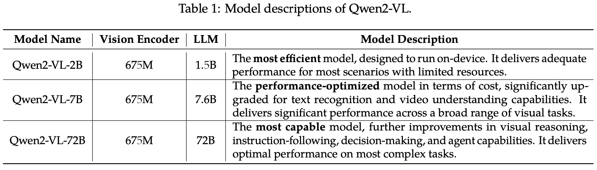
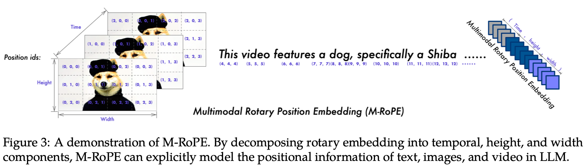

> 多模态的第一篇系统性笔记贡献给通义千问系列，目前应该是国内效果独一档的模型了。当然因为本人对其他公司的一些进展暂时没有跟进，所以也是自己的瞎点评。当然写这篇文章的出发点也是为了激励自己日后多多总结，扩展自己的知识面。

通义千问最近新发布了他们的Qwen2-VL系列模型（主要包括2B、7B和72B三个规模的模型，其中2B主要是用于端侧部署）。最早应该是先发布了两个小模型，后面跟着把72B的模型和论文一起发出来了，难怪中间这段时间在modelscope上找创空间并没有找到72B对应的东西。
三个模型具体的区别可见下表，



新模型支持的特性（并不是说以前的模型没有）有以下几点：
1. 支持图像、视频、文本的三种模态输入
2. 支持任意resolution & aspect ratio的图像/视频输入


基于此我们需要关注该模型具体的实现细节有以下几点：
1. [统一图片与视频处理]：视频在输入的过程中多出来的temporal维度是如何被处理的？
2. [M-RoPE]：如何设计一种多模态RoPE将图像、视频以及文本三种模态一同输入到LLM中去进行处理
3. [ViT 2D-RoPE]：一种针对任意 resolution & aspect ratio的图像输入ViT中使用的2D-RoPE


首先做一些基本的回顾

从最简单的图片来说，我们可以先回顾一下一般的实现方法，这里主要回顾从图片到进入transformer blocks之前的处理，主要分为以下几步，
1. 将图片resize成固定大小，如224*224
2. 将图片按照固定patch size进行切分，设ps=16，那么我们就会将图片从高度和宽度两个方向，切分成 (224 // 16) ** 2 = 196 个patches
3. 将这些patches从2D的排布flatten成1D的，即1 * 3 * (14 * 16) * (14 * 16) -> (1, 14 * 14, (16 * 16 * 3))
4. 对patches做Patch Embedding，即 (1, 14 * 14, (16 * 16 * 3)) -> (1, 196, 768)，看着维度是没有变化，但实际上是做了linear projection的
5. 对每个位置加上一个learnable absolute position embedding，引入空间位置信息

## 统一图片与视频处理
如果这时候我们开始引入视频数据，我们的输入数据维度就从以往的(1,3,224,224)变成了(1,16,3,224,224)，其中16所在的维度代表视频帧数，即16帧。这时候一般的处理方法会将16这一维度后续一起放到(b,t,h)中的t的维度上去，即如果一张图片在最后进入transformer blocks中之前的维度是(1,196,768)的话，那它对应的视频维度则是(1, 196*16, 768)了。
上面我们讲述的是一般的处理方法，接下来我们看看Qwen2-VL中的处理方式。主要关注以下几点，
1. 视频数据采样方式：以往的视频推理的模型在视频数据进入模型之前一定是会做采样处理的，否则单个视频数据需要处理的数据量远远超过单张图片的，且存在很大程度上的冗余。这里论文里采用了 sample two frames per second的采样策略。
2. temporal维度进一步融合：回顾一般的处理方法中，直接将16放到了t=196的维度上，我们相当于是设置了一个temporal_patch_size=1的参数，这里怎么理解temporal_patch_size呢？在spatial维度上，我们有patch_size=16，那在temporal维度上我们也可以定义一个patch_size用于空间维度的切分，在这种设定下(temporal_patch_size, patch_size, patch_size)内的像素最后都会作为同一个token存在。
3. 统一图片与视频处理：图片可以看作是n_frames=1的视频的特殊情况，又因为2中有Qwen2-VL会将连续2个frames在temporal维度上进一步融合，所以代码中有这样的处理
`patches = np.tile(patches, (self.temporal_patch_size, 1, 1, 1))`


## M-RoPE
【假设我们前面已经回顾了比如LLaVA的LLM中使用的位置编码】那不同于以往的LLM中的1D位置编码，Qwen2-VL设计了一种叫3D-RoPE的东西，即针对每一个token其对应的position_id都是一个3维的东西，分别代表其在temporal, spatial(h & w)上的postion id，对于图像来说这三个维度都是比较好理解的，而对于文本来说，这三个维度上的postion_id都是一致的，可以证明这时文本的3d-RoPE等价于1d-RoPE。M-RoPE论文中也有一张比较清晰的图，如下

从图中可以简单发现几点，
1. 同一帧内的所有图片的temporal_position_id一致
2. 不同帧之间的图片的spatial_position_id一致
3. 文本部分的position_id由前一个模态的position_id的最大值决定

当我们施加一个位置编码时，我们应该注意三点，对于Qwen2-VL我们逐一作答，
1. patches是怎么排布的，是像base ViT那样直接flatten么？
```python
patches = patches.reshape(
    grid_t,
    self.temporal_patch_size,
    channel,
    grid_h // self.merge_size,
    self.merge_size,
    self.patch_size,
    grid_w // self.merge_size,
    self.merge_size,
    self.patch_size,
)
patches = patches.transpose(0, 3, 6, 4, 7, 2, 1, 5, 8)
flatten_patches = patches.reshape(
    grid_t * grid_h * grid_w, channel * self.temporal_patch_size * self.patch_size * self.patch_size
)
```
通过上述这一通reshape的操作，patches的排布从原本简单的flatten，变成了下面的样子
```
假设原图 resize 后划分成了如下的若干 patch

patch_1 , patch_2 , patch_5 , patch_6 , 
patch_3 , patch_4 , patch_7 , patch_8 ,
patch_9 , patch_10 , patch_13 , patch_14
patch_11 , patch_12 , patch_15 , patch_16


模型会将这些 patch 进行flatten，随后通过VIT获取到这些 patch 的特征,

注意，qwen2vl 在对这些 patch 进行 flatten 的时候，会按照如下的顺序进行 flatten(每4个相邻的放在一起)

feature = [
  f1 , f2 ,  f3 , f4 , f5 , f6 , f7 , f8 , f9 ,f10 ,  f11 , f12 , f13 , f14, f15 , f16
]
```
这样操作的合理性在于空间维度上相邻像素点的位置应该是更近而非更远的，如果按照原始直接flatten的排布，第一行和第二行的patch的位置就会离得很远，但这样做其实只是在一定程度上（patch merger size范围内）相对缓和了这一问题。此外因为此时我们的patches排布变成了`[f1 , f2 ,  f3 , f4 , f5 , f6 , f7 , f8 , f9 ,f10 ,  f11 , f12 , f13 , f14, f15 , f16]`，这里Qwen2-VL通过将相邻4个patch的特征合为1个特征的方法，进一步达到了降低visual tokens个数的目的，这也符合我们对spatial维度上存在一定程度信息冗余的先验知识。
```python
[
    f1 , f2 , f5 , f6 , 
    f3 , f4 , f7 , f8 , 
    f9 , f10 , f13 , f14, 
    f11 , f12 , f15 , f16
] # (1, 16, 768)
[
	f_1_2_3_4,    f_5_6_7_8,
	f_9_10_11_12, f_13_14_15_16
] # (1, 4, 768*4)，对应 self.ln_q(x).view(-1, self.hidden_size)
# 后续再做linear layer融合

class PatchMerger(nn.Module):
    def __init__(self, dim: int, context_dim: int, spatial_merge_size: int = 2) -> None:
        super().__init__()
        self.hidden_size = context_dim * (spatial_merge_size**2) # 1280 * （2**2） dim: 3584
        self.ln_q = LayerNorm(context_dim, eps=1e-6)
        self.mlp = nn.Sequential(
            nn.Linear(self.hidden_size, self.hidden_size),
            nn.GELU(),
            nn.Linear(self.hidden_size, dim),
        )

    def forward(self, x: torch.Tensor) -> torch.Tensor:
        x = self.mlp(self.ln_q(x).view(-1, self.hidden_size))
        return x
```
2. position ids是如何生成的，是直接arange吗？
```python
# 针对每一个example / input 都有一个 llm_pos_ids_list = [] （初始化）
# st_idx的确定方式
st_idx = llm_pos_ids_list[-1].max() + 1 if len(llm_pos_ids_list) > 0 else 0

# 文本处理：append一个(3, text_len)维度的tensor，其值从[st_idx, st_idx+text_len] -> 给文本占位
llm_pos_ids_list.append(torch.arange(text_len).view(1, -1).expand(3, -1) + st_idx)

# 图像或视频处理：append一个(3, image_len)维度的tensor，其值从[st_idx+text_len, st_idx+text_len+image_len] -> 给图像占位
llm_pos_ids_list.append(torch.stack([t_index, h_index, w_index]) + text_len + st_idx)
```

3. 位置编码是如何施加上去的，加法还是乘法？3d-RoPE如何施加呢？
首先这里我们先引入一个超参数mrope_section，它是一个长的为3的list[int]，其中每一个元素分别对应t,h,w这三个维度，该超参数被设置成[16,24,24]，其加和为64。具体地，3d-RoPE的作用方式见如下代码，
```python
def apply_multimodal_rotary_pos_emb(q, k, cos, sin, mrope_section, unsqueeze_dim=1):

    mrope_section = mrope_section * 2
    cos = torch.cat([m[i % 3] for i, m in enumerate(cos.split(mrope_section, dim=-1))], dim=-1).unsqueeze(
        unsqueeze_dim
    )
    sin = torch.cat([m[i % 3] for i, m in enumerate(sin.split(mrope_section, dim=-1))], dim=-1).unsqueeze(
        unsqueeze_dim
    )

    q_embed = (q * cos) + (rotate_half(q) * sin)
    k_embed = (k * cos) + (rotate_half(k) * sin)
    return q_embed, k_embed

# 逐步将上面的步骤拆解
# mrope_section : [16, 24, 24, 16, 24, 24]
# 1. cos.split(mrope_section, dim=-1)     

# 将cos: [3, 1, 4242, 128]在token 的position embedding维度上按照 mrope_section 进行拆分      
# [
    # torch.Size([3, 1, 4242, 16]),     
    # torch.Size([3, 1, 4242, 24]),     
    # torch.Size([3, 1, 4242, 24]),     
    # torch.Size([3, 1, 4242, 16]),     
    # torch.Size([3, 1, 4242, 24]),     
    # torch.Size([3, 1, 4242, 24])
# ]   

# [i%3 for i in range(6)] -> [0, 1, 2, 0, 1, 2]
# 2. [m[i % 3] for i, m in enumerate(cos.split(mrope_section, dim=-1))]     
# 会得到     
# [
    #  torch.Size([1, 4242, 16]),    t 
    #  torch.Size([1, 4242, 24]),    h
    #  torch.Size([1, 4242, 24]),    w
    #  torch.Size([1, 4242, 16]),    t
    #  torch.Size([1, 4242, 24]),    h
    #  torch.Size([1, 4242, 24])     w
# ]  

# 3. torch.cat 会得到最终所需要的向量      
# torch.Size([1, 4242, 128])     
# cos_t = [t0, t1, t2, ..., t127] 
# cos_h = [h0, h1, h2, ..., h127] 
# cos_w = [w0, w1, w2, ..., w127] 
# cos_thw = [t0, t1, ..., t15, h16, h17, ..., h39, w40, w41, ..., w63, ...]，sin也是类似的
```

## ViT 2D-RoPE
在上述回顾过程中我们可以注意到，base ViT存在两个问题，
1. 图片需要被resize成固定尺寸，而且一般支持的尺寸都比较小，这意味着我们在第一步就会丢失很多视觉信息。
2. 位置编码的方式使用的是可学习的绝对位置编码，这里我们已知一个结论是【绝对位置编码没有相对位置编码来得那么好的外推性】。假设有一天我们解决了图片需要被resize成固定尺寸这一前提，当我们输入的图片分辨率越来越高时，对应的patch token数量就越来越多，这时候如果依然使用外推性不那么好的绝对位置编码，就有可能效果变差，所以相对位置编码也在后续逐步引入到了ViT中来。

同样地我们仍然关注上述的三个问题，
1. patches的排布方式
2. position ids的生成方式

这里我们把1和2放在一起看，
```python
pos_ids = []
for t, h, w in grid_thw:
    hpos_ids = torch.arange(h).unsqueeze(1).expand(-1, w)
    hpos_ids = hpos_ids.reshape(
        h // self.spatial_merge_size,
        self.spatial_merge_size,
        w // self.spatial_merge_size,
        self.spatial_merge_size,
    )
    hpos_ids = hpos_ids.permute(0, 2, 1, 3)
    hpos_ids = hpos_ids.flatten()

    wpos_ids = torch.arange(w).unsqueeze(0).expand(h, -1)
    wpos_ids = wpos_ids.reshape(
        h // self.spatial_merge_size,
        self.spatial_merge_size,
        w // self.spatial_merge_size,
        self.spatial_merge_size,
    )
    wpos_ids = wpos_ids.permute(0, 2, 1, 3)
    wpos_ids = wpos_ids.flatten()
    pos_ids.append(torch.stack([hpos_ids, wpos_ids], dim=-1).repeat(t, 1))
pos_ids = torch.cat(pos_ids, dim=0)


# copy from https://zhuanlan.zhihu.com/p/717884243
# VIT 部分只考虑了 x / y 两个维度的 position ids 
# 参考 Qwen2VisionTransformerPretrainedModel：rot_pos_emb

# patches :

# patch_1 , patch_2 , patch_3 , patch_4 , 
# patch_5 , patch_6 , patch_7 , patch_8 ,
# patch_9 , patch_10 , patch_11 , patch_12
# patch_13 , patch_14 , patch_15 , patch_16

# 为每一个位置分配  h  / w 方向上的坐标 

# [
#     patch_1(0,0), patch_2(0,1), patch_3(0,2), patch_4(0,3), patch_5(0,4), patch_6(0,5), 
#     patch_6(1,0), patch_7(1,1), patch_8(1,2), patch_9(1,3), patch_10(1,4), patch_11(1,5), 
#     patch_12(2,0), patch_13(2,1), patch_14(2,2), patch_15(2,3), patch_16(2,4), patch_17(2,5),
#     patch_18(3,0), patch_19(3,1), patch_20(3,2), patch_21(3,3), patch_22(3,4), patch_23(3,5),
#     patch_24(4,0), patch_25(4,1), patch_26(4,2), patch_27(4,3), patch_28(4,4), patch_29(4,5),
#     patch_30(5,0), patch_31(5,1), patch_32(5,2), patch_33(5,3), patch_34(5,4), patch_35(5,5)
# ]

# hpos_ids
# Out[13]: 
# tensor([0, 0, 1, 1, 0, 0, 1, 1, 0, 0, 1, 1, 2, 2, 3, 3, 2, 2, 3, 3, 2, 2, 3, 3,
#         4, 4, 5, 5, 4, 4, 5, 5, 4, 4, 5, 5])

# wpos_ids
# Out[14]: 
# tensor([0, 1, 0, 1, 2, 3, 2, 3, 4, 5, 4, 5, 0, 1, 0, 1, 2, 3, 2, 3, 4, 5, 4, 5,
#         0, 1, 0, 1, 2, 3, 2, 3, 4, 5, 4, 5])

# 对于 flatten 后的 patch 序列，得到如下的 2d position 序列
# torch.stack([hpos_ids, wpos_ids], dim=-1).repeat(t, 1)

# pos_ids[0].T 
# Out[16]: 
# tensor([[0, 0, 1, 1, 0, 0, 1, 1, 0, 0, 1, 1, 2, 2, 3, 3, 2, 2, 3, 3, 2, 2, 3, 3, 4, 4, 5, 5, 4, 4, 5, 5, 4, 4, 5, 5],
#         [0, 1, 0, 1, 2, 3, 2, 3, 4, 5, 4, 5, 0, 1, 0, 1, 2, 3, 2, 3, 4, 5, 4, 5, 0, 1, 0, 1, 2, 3, 2, 3, 4, 5, 4, 5]])
```
我们可以发现这里patches的排布方式仍然与M-RoPE中提到的第1点的排布方式保持一致，且需要注意的是在temporal维度pos_ids是通过repeat完成的。

3. 位置编码的施加方式
```python
# 拿到t,h,w三个维度上的最大grid数，或者说max_grid_index
max_grid_size = grid_thw[:, 1:].max()

# self.rotary_pos_emb = VisionRotaryEmbedding(head_dim // 2)
rotary_pos_emb_full = self.rotary_pos_emb(max_grid_size) # 返回一个[max_grid_size, 20]维度的tensor
rotary_pos_emb = rotary_pos_emb_full[pos_ids].flatten(1) # 返回一个[#num_tokens, 2, 20] -> [#num_tokens, 40]维度的tensor

# VisionAttention
q = apply_rotary_pos_emb_vision(q.unsqueeze(0), rotary_pos_emb).squeeze(0)
k = apply_rotary_pos_emb_vision(k.unsqueeze(0), rotary_pos_emb).squeeze(0)

def apply_rotary_pos_emb_vision(tensor: torch.Tensor, freqs: torch.Tensor) -> torch.Tensor:
    orig_dtype = tensor.dtype
    tensor = tensor.float()
    cos = freqs.cos()
    sin = freqs.sin()
    # 可以看到 ， rope 向量的 dim 和 tensor 的 dim 没有完全对上，因此这里进行了 repeat 
    cos = cos.unsqueeze(1).repeat(1, 1, 2).unsqueeze(0).float()
    sin = sin.unsqueeze(1).repeat(1, 1, 2).unsqueeze(0).float()
    output = (tensor * cos) + (rotate_half(tensor) * sin)
    output = output.to(orig_dtype)
    return output
```


# TODO：后续需要补全的知识
1. RoPE的原理与源码
2. 其他MLLM中LLM使用的位置编码方式
3. Qwen-VL与Qwen2-VL之间的区别（待选）